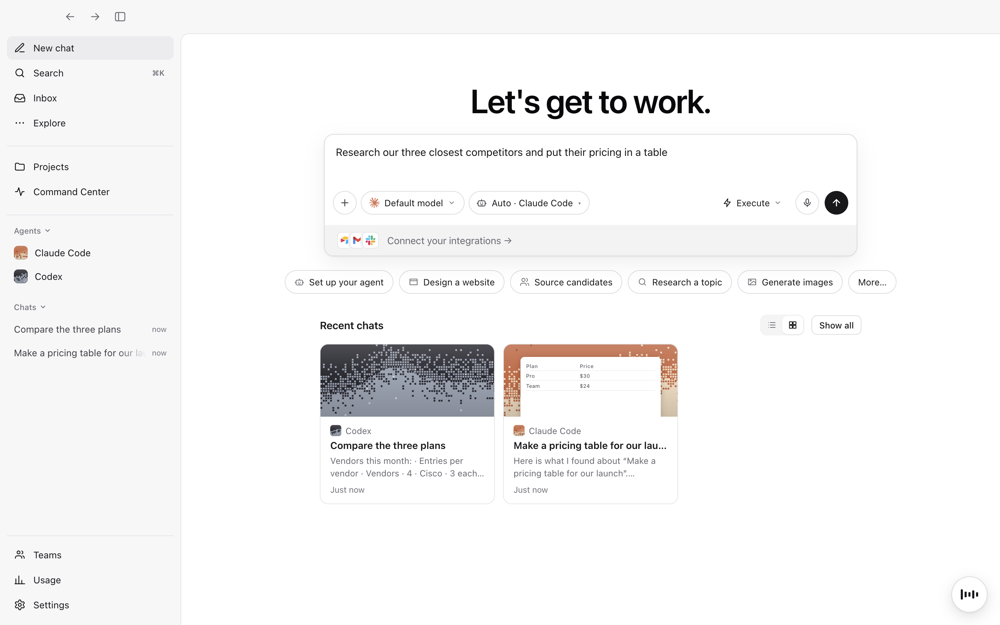
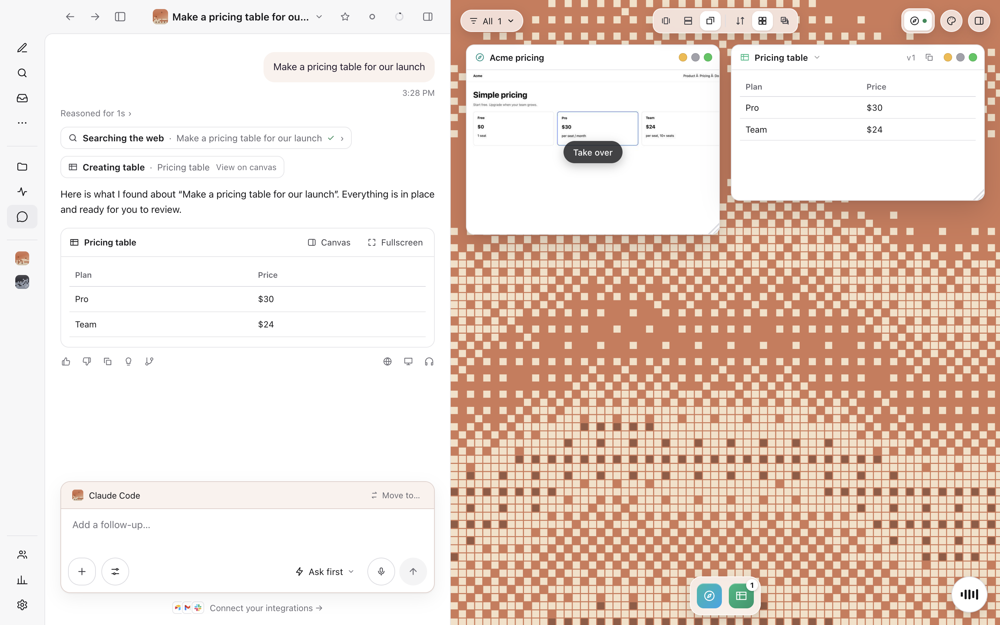
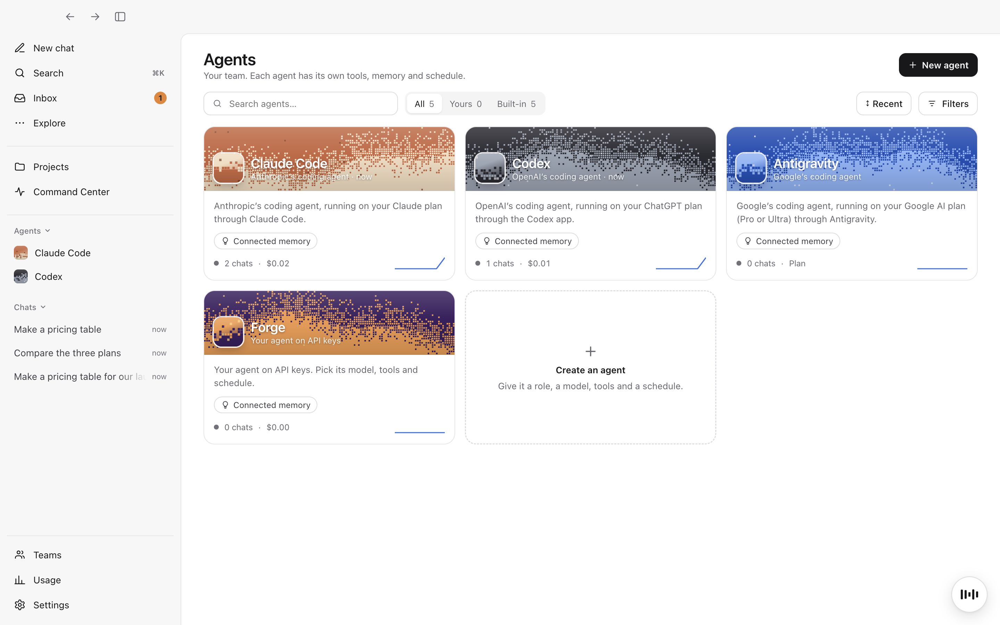
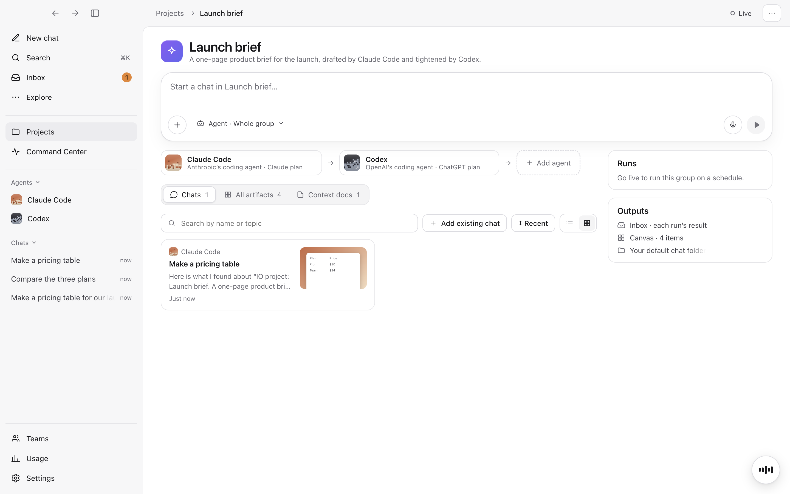
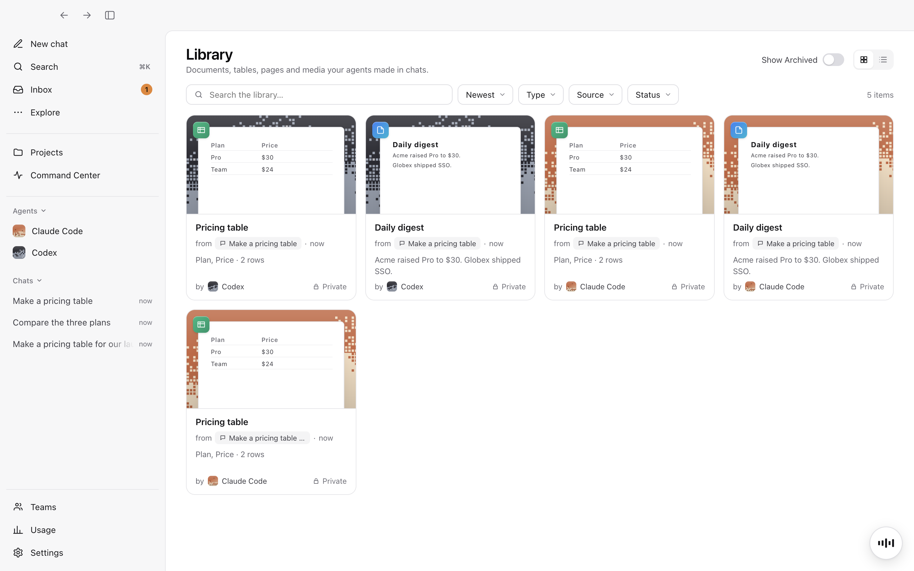
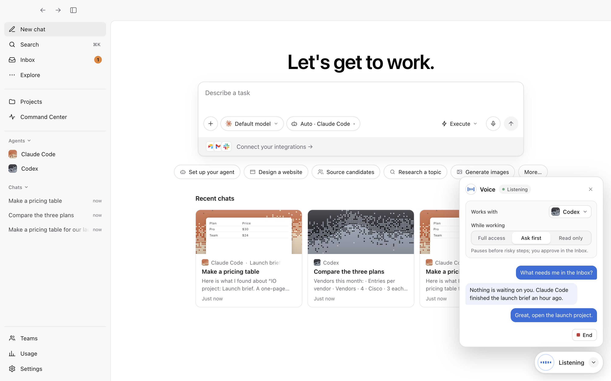

  

  <b>A desktop app for working with AI agents</b> 
  Claude Code, Codex and Antigravity on the plans you already pay for, and your own agents on your own API keys, in one place.

  <a href="https://github.com/rapheal-sacr/io-releases/releases/latest"><b>Download the latest IO</b></a> ·
  Mac (Apple silicon) · Windows (x64) · Linux (x64)

---

## What IO is

IO is one window for all your agents. You describe a task; IO picks the agent (or you do), runs it, and puts what it makes (docs, tables, slides, web pages, images) on a canvas beside the chat. Agents can hand work to each other, run as a team on a project, follow a schedule, use their own browser, and remember what matters about you.

- **Your plans, not new bills.** Claude Code (Claude Pro/Max), Codex (ChatGPT plans) and Antigravity (Google AI Pro/Ultra) run through their official adapters on your own sign-ins. IO never sees your password or tokens.
- **Your keys for everything else.** Forge and the agents you create run on the **IO Runtime** (IO's fork of MiniMax Code) with your own Anthropic, OpenAI, Google or OpenRouter keys, stored in the system keychain and never written to disk in plain text.
- **You stay in charge.** Every agent asks before risky steps unless you let it run (Ask first, Full access or Read only, per chat). Approvals and results wait in one Inbox.

## A look around

| | |
|---|---|
|  **Chat and canvas.** What the agent makes appears beside the chat as windows, a carousel or tiles, with the agent's own browser among them. |  **Agents.** Built-in plan agents, Forge on your keys, and agents you create with their own role, model, tools, skills and schedule. |
|  **Projects.** A group of agents with a shared context doc and canvas. Run the whole group (each agent passes its result to the next) or one agent at a time, on demand or on a schedule. |  **Library.** Everything your agents made, from every chat, searchable and filterable. |
|  **Voice.** Talk to IO: it opens pages, checks on your agents, gives you a tour, and hands them work while you keep talking. | |

## Features

**Chats and agents**
- Auto picks the best agent for each message (with the Laya decision engine), or choose one yourself.
- Plan first: the agent writes a plan and waits for your OK.
- Move a chat to another agent mid-conversation (Claude Code ↔ Codex ↔ API keys) when one runs out of usage.
- Delegation: agents hand work to each other and get the result back; each hand-off shows as a card with its own chat.
- Slash commands, `@` mentions of skills, agents, chats and files, prompt suggestions, and dictation in every prompt box.

**The canvas and the browser**
- Docs, tables, slides, web pages, images, video and audio, each with version history, Publish, Download and Bookmark.
- The agent's own browser: watch it work, take over to sign in or click, and hand it back.
- Google Docs, Slides and Sheets: agents read and edit them through Google's APIs; decks show as Google draws them.

**Projects and schedules**
- Projects share a context doc and canvas across their chats; whole-group runs pass work from agent to agent.
- Go live: run a chat or project on a schedule, with results in the Inbox (or Slack).

**Memory and learning**
- Memories: what IO knows about you and your work, proposed by agents and approved by you, plus imports from ChatGPT, Claude and Manus.
- Learning: suggested improvements to prompts, memories, skills and rubrics from your finished chats.
- Rubrics: a judge agent scores chats against weighted criteria.
- Skills: reusable instructions agents load when they help.

**Teams, rooms and Slack**
- Teams sync agents, skills and memories between teammates' computers over Tailscale, with no server in between.
- Rooms: group chats where people and agents work together.
- Slack: give an API-key agent its own Slack bot, with approvals as buttons in the thread.

**Usage and benchmarks**
- Usage by agent, plan and key, with plan limits and real spend.
- Benchmarks: run one prompt across several agents and have a critic score the answers.

**Bring your history**
- Import chats from Codex and Claude Code on your computer (they continue in the same session), and from ChatGPT or Claude data exports.

## Install

Download the latest release from the [Releases page](https://github.com/rapheal-sacr/io-releases/releases/latest):

| System | File | First launch |
|---|---|---|
| macOS (Apple silicon) | `IO-<version>-arm64.dmg` | Drag IO to Applications. The first time, macOS asks to confirm: System Settings › Privacy & Security › **Open Anyway**. |
| Windows 10/11 (x64) | `IO-Setup-<version>.exe` | SmartScreen may say "Windows protected your PC": **More info › Run anyway**. |
| Linux (x64) | `IO-<version>-x86_64.AppImage` | `chmod +x IO-*.AppImage` and run it. Needs Ubuntu 24.04, Debian 13, Fedora 40 or newer. |

On first launch IO offers to download the plan agents you use (Claude Code, Codex, Antigravity) and sign you in with each app's own login. IO updates itself.

## Privacy and security

- API keys live in the system keychain (Electron safeStorage), never in config files, logs or commits.
- Plan sign-ins happen only through each provider's official app or adapter; IO doesn't handle subscription credentials.
- Agent output, files and web pages are treated as data, not instructions. The Laya guard flags text aimed at the agent, and risky steps ask first.
- Your chats, memories and canvas items stay on your computer unless you share them with a team or publish an item.

---

## Versions

The current public line started at **0.1.0**. Earlier development builds are kept on the Releases page as pre-releases named "IO dev 0.1.x". If you installed one of those, download the current version once; from then on IO updates itself.

## Feedback

Found a bug or have an idea? Use **Help › Send Feedback…** in IO (it opens a prefilled issue here), or [open an issue](https://github.com/rapheal-sacr/io-releases/issues). **Help › Export Diagnostics…** saves a zip with no keys, chat text or memories that you can attach.

Screenshots are from a development build with demo data.
